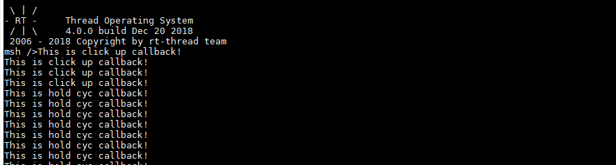

# 第 2 节：使用 pin 设备实现按键控制

之前我们学习了利用 pin 设备控制 led 的亮灭，这一节我们学习利用 pin 设备进行按键的控制。

## 基础知识

按键控制的实现有很多的方式，在裸机编程的时候最常用的就是延时消抖以及抬手检测了，可以很简单的就实现按键的输入。其实还有更加简单、灵活的按键处理方式，就是每隔一定的时间间隔扫描一次按键的状态，如果连续多次按键的状态都是按下的状态，我们就认为按键是按下的。

在裸机编程的时候，按键处理一般是轮询的方式获取按键的状态，然后再根据按键的不同状态进行对应的操作。但是在 RT-Thread 上可以有更优雅的实现方式，那就是使用回调函数的方式。我们可以为每一个按键的事件注册按键回调事件，这样就可以将键值的读取，按键状态的判断都交给驱动程序来实现。在使用按键的时候，只要注册上对应的处理函数，待按键发生对应的事件之后，就会自动执行相应的逻辑代码。使按键处理的代码更及时，更独立。

现在我们就用 RT-Thread 的 pin 设备来实现一个简单的按键驱动库，为了满足播放器控制的需求，需要能够区分 `短按` 和 `长按` 事件。

## 硬件连接

以正点原子探索者 STM32F4 开发板为例。开发板上有四个供用户使用的按键 KEY_UP/KEY0/1/2，通过原理图可以看出，KEY0/1/2 三个按键对应的 PIN 分别是 1/2/3。


## 软件实现

为了更好的判断按键的事件，我们可以定义一个枚举类型 `my_button_event`。其中 `BUTTON_EVENT_HOLD_CYC` 的意义就是：在长按的时候可以每隔一定的时间间隔，就触发一次，方便进行音量的调节。

```{.c}
enum my_button_event
{
    BUTTON_EVENT_CLICK_DOWN, /* 按键单击按下事件 */
    BUTTON_EVENT_CLICK_UP,   /* 按键单击结束事件 */
    BUTTON_EVENT_HOLD,       /* 按键长按开始事件 */
    BUTTON_EVENT_HOLD_CYC,   /* 按键长按周期性触发事件 */
    BUTTON_EVENT_HOLD_UP,    /* 按键长按结束事件 */
    BUTTON_EVENT_NONE        /* 无按键事件 */
};
```

然后写一个结构体，将按键相关的信息都放到一起，方便统一管理。

```{.c}
struct my_button
{
    rt_uint8_t  press_logic_level;  /* 按键按下时的电平 */
    rt_uint16_t cnt;                /* 连续扫描到按下状态的次数 */
    rt_uint16_t hold_cyc_period;    /* 长按周期回调的周期 */
    rt_uint16_t pin;                /* 按键对应的 pin 编号 */

    enum my_button_event event;     /* 按键的触发的事件 */

    my_button_callback cb;          /* 按键触发事件回调函数 */
};
```

这只是一个按键的抽象，我们使用按键不可能只使用一个，因此需要定义一个存储按键的结构体，以及一个注册按键的 API。

```{.c}
int my_button_register(struct my_button *button);
```

```{.c}
struct my_button_manage
{
    rt_uint8_t num;                 /* 已注册的按键的数目 */
    rt_timer_t timer;               /* 按键扫描用到的定时器 */
    struct my_button *button_list[MY_BUTTON_LIST_MAX];  /* 存储按键指针的数组 */
};
static struct my_button_manage button_manage;
```

这样只要在调用 `my_button_register` API 时将传进来的按键结构体添加到 button_manage 这个结构体里即可

```{.c}
int my_button_register(struct my_button *button)
{
    /* 初始化按键对应的 pin 模式 */
    if (button->press_logic_level == 0)
    {
        rt_pin_mode(button->pin, PIN_MODE_INPUT_PULLUP);
    }
    else
    {
        rt_pin_mode(button->pin, PIN_MODE_INPUT_PULLDOWN);
    }

    /* 初始化按键结构体 */
    button->cnt = 0;
    button->event = BUTTON_EVENT_NONE;

    /* 添加按键到管理列表 */
    button_manage.button_list[button_manage.num++] = button;
    
    return 0;
}
```

然后创建一个定时器，定时扫描一遍按键的状态，下面是扫描函数的实现，逻辑还是很简单的，只要按下的时间达到相应的触发条件，就执行相应的回调函数

```{.c}
#define MY_BUTTON_DOWN_MS        50
#define MY_BUTTON_HOLD_MS        700

#define MY_BUTTON_CALL(func, argv) \
    do { if ((func) != RT_NULL) func argv; } while (0)

static void my_button_scan(void *param)
{
    rt_uint8_t i;
    rt_uint16_t cnt_old;

    for (i = 0; i < button_manage.num; i++)
    {
        cnt_old = button_manage.button_list[i]->cnt;

        /* 检测按键的电平状态为按下状态 */
        if (rt_pin_read(button_manage.button_list[i]->pin) == button_manage.button_list[i]->press_logic_level)
        {
            /* 按键扫描的计数值加一 */
            button_manage.button_list[i]->cnt ++;

            /* 连续按下的时间达到单击按下事件触发的阈值 */
            if (button_manage.button_list[i]->cnt == MY_BUTTON_DOWN_MS / MY_BUTTON_SCAN_SPACE_MS) /* BUTTON_DOWN */
            {
                LOG_D("BUTTON_DOWN");
                button_manage.button_list[i]->event = BUTTON_EVENT_CLICK_DOWN;
                MY_BUTTON_CALL(button_manage.button_list[i]->cb, (button_manage.button_list[i]));
            }
            /* 连续按下的时间达到长按开始事件触发的阈值 */
            else if (button_manage.button_list[i]->cnt == MY_BUTTON_HOLD_MS / MY_BUTTON_SCAN_SPACE_MS) /* BUTTON_HOLD */
            {
                LOG_D("BUTTON_HOLD");
                button_manage.button_list[i]->event = BUTTON_EVENT_HOLD;
                MY_BUTTON_CALL(button_manage.button_list[i]->cb, (button_manage.button_list[i]));
            }
            /* 连续按下的时间达到长按周期回调事件触发的阈值 */
            else if (button_manage.button_list[i]->cnt > MY_BUTTON_HOLD_MS / MY_BUTTON_SCAN_SPACE_MS) /* BUTTON_HOLD_CYC */
            {
                LOG_D("BUTTON_HOLD_CYC");
                button_manage.button_list[i]->event = BUTTON_EVENT_HOLD_CYC;
                if (button_manage.button_list[i]->hold_cyc_period && button_manage.button_list[i]->cnt % (button_manage.button_list[i]->hold_cyc_period / MY_BUTTON_SCAN_SPACE_MS) == 0)
                    MY_BUTTON_CALL(button_manage.button_list[i]->cb, (button_manage.button_list[i]));
            }
        }
        /* 检测按键的电平状态为抬起状态 */
        else
        {
            /* 清除按键的计数值 */
            button_manage.button_list[i]->cnt = 0;
            /* 连续按下的时间达到单击结束事件触发的阈值 */
            if (cnt_old >= MY_BUTTON_DOWN_MS / MY_BUTTON_SCAN_SPACE_MS && cnt_old < MY_BUTTON_HOLD_MS / MY_BUTTON_SCAN_SPACE_MS) /* BUTTON_CLICK_UP */
            {
                LOG_D("BUTTON_CLICK_UP");
                button_manage.button_list[i]->event = BUTTON_EVENT_CLICK_UP;
                MY_BUTTON_CALL(button_manage.button_list[i]->cb, (button_manage.button_list[i]));
            }
            /* 连续按下的时间达到长按结束事件触发的阈值 */
            else if (cnt_old >= MY_BUTTON_HOLD_MS / MY_BUTTON_SCAN_SPACE_MS) /* BUTTON_HOLD_UP */
            {
                LOG_D("BUTTON_HOLD_UP");
                button_manage.button_list[i]->event = BUTTON_EVENT_HOLD_UP; 
                MY_BUTTON_CALL(button_manage.button_list[i]->cb, (button_manage.button_list[i]));
            }
        }
    }
}
```
然后再在 `int my_button_start(void);` API 里执行定时器的初始化，定时执行这个按键扫描的函数。

```{.c}
int my_button_start()
{
    if (button_manage.timer != RT_NULL)
        return -1;

    /* 创建定时器1 */
    button_manage.timer = rt_timer_create("timer1", /* 定时器名字是 timer1 */
                             my_button_scan, /* 超时时回调的处理函数 */
                             RT_NULL, /* 超时函数的入口参数 */
                             RT_TICK_PER_SECOND * MY_BUTTON_SCAN_SPACE_MS / 1000, /* 定时长度，以OS Tick为单位，即10个OS Tick */
                             RT_TIMER_FLAG_PERIODIC | RT_TIMER_FLAG_SOFT_TIMER); /* 周期性定时器 */
    /* 启动定时器 */
    if (button_manage.timer != RT_NULL)
        rt_timer_start(button_manage.timer);

    return 0;
}
```

## 示例程序

 这一节的示例程序实现的是利用按键 KEY2 控制 led 的亮灭，每按一次按键就会翻转一次 led 的状态。实现的方式是：

 1. 包含 `button.h` 的头文件
 2. 实现按键回调函数
 3. 初始化按键的结构体
 4. 注册按键
 5. 启动按键扫描

详细的代码如下所示：

```{.c}
#include <rtthread.h>
#include "led.h"
#include "button.h"

#define KEY_PIN          1
#define KEY_PRESS_VALUE  0

void key_cb(struct my_button *button)
{
    switch (button->event)
    {
    case BUTTON_EVENT_CLICK_UP:
        led_toggle();
        rt_kprintf("This is click up callback!\n");
        break;
    case BUTTON_EVENT_HOLD_CYC:
        rt_kprintf("This is hold cyc callback!\n");
        break;
    default:
        ;
    }
}

int main(void)
{
    /* user app entry */
    static struct my_button key = {0};

    led_init();

    key.press_logic_level = KEY_PRESS_VALUE;
    key.hold_cyc_period = 100;
    key.cb = (my_button_callback)key_cb;
    key.pin = KEY_PIN;

    my_button_register(&key);
    my_button_start();

    return RT_EOK;
}
```



## 程序源码

[button.c/.h](https://github.com/Guozhanxin/RTT-BeepPlayer/tree/master/code/button)

[示例程序](https://github.com/Guozhanxin/RTT-BeepPlayer/blob/master/samples/main_6.c)