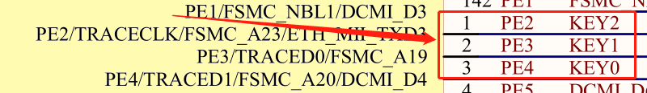
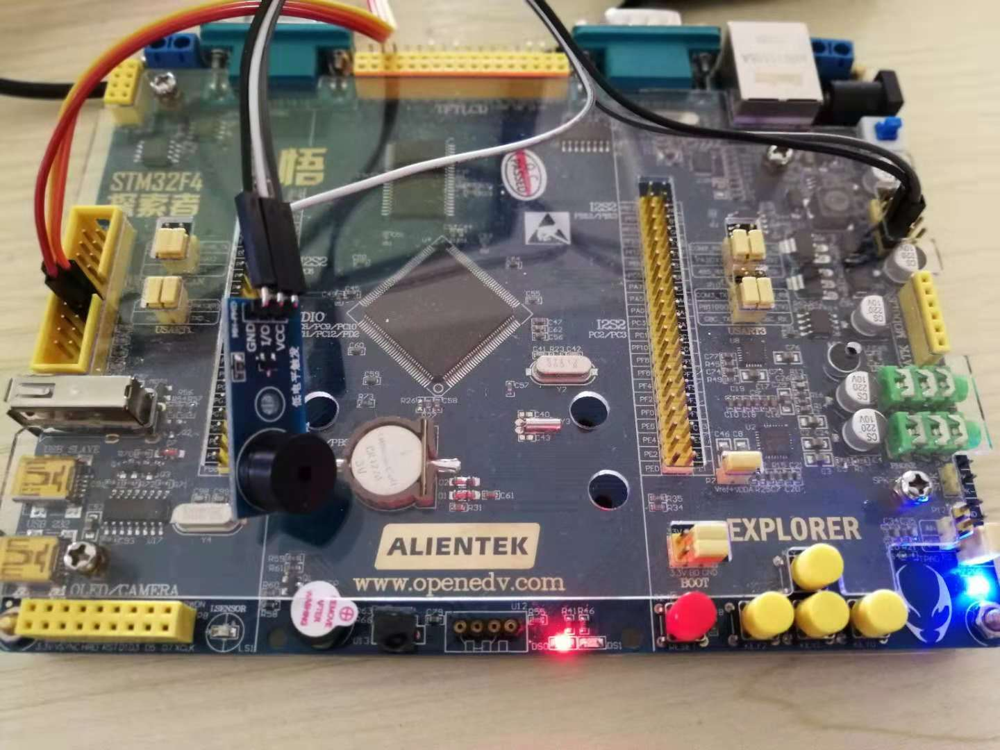

# 第 6 节：为播放器添加按键控制

上一节的示例程序，演示了播放器内核的基础使用，但是只能循环播放，不能控制的播放器叫什么播放器。因此，这一节我们使用之前写的 button 按键库驱动按键，并实现按键控制播放器的行为：上一曲、下一曲、暂停/播放，音量调节。

## 硬件连接

以正点原子探索者 STM32F4 开发板为例。开发板上有四个供用户使用的按键 KEY_UP/KEY0/1/2，通过原理图可以看出，KEY0/1/2 三个按键对应的 PIN 分别是 1/2/3。



## 软件实现

要做一个音乐播放器，需要有什么按键的功能呢？暂停/播放，上一曲，下一曲，音量加/减。要实现这几个按键的功能，需要借助 button 驱动库的单击事件和长按事件。

根据按键在开发板上的排布，我们使用左边的 KEY2 作为`上一曲`的按键，长按为`音量减`；右边的按键 KEY0 作为`下一曲`的按键，长按为`音量加`；中间的按键 KEY1 作为 `暂停/播放` 的按钮。

为了使按键处理的代码更清晰，使用按键回调的方式处理按键事件，当有按键事件发生时，直接调用对应的事件回调函数处理。这样所有的业务代码都将在模块内部实现，只需要一个初始化函数供外部调用即可。

```{.c}
int key_init(void);                     //按键初始化
```

同样我们新建一个 `key.h` 的文件，将按键初始化函数声明放到  `key.h` 文件里，方便其他文件的调用。

然后再新建一个 `key.c` 文件，在文件里添加下面的头文件

```{.c}
#include <rtthread.h>  //RT-Thread 标准头文件
#include <rtdevice.h>  //使用 RT-Thread 的设备需要包含此头文件
#include "button.h"    //之前实现的按键驱动库
#include "key.h"
```

为了程序更好的可移植性，把 key 使用的 PIN 设备用宏定义的方式来表示，如下所示：

```{.c}
#define KEY_PLAY_PIN     2
#define KEY_LAST_PIN     1
#define KEY_NEXT_PIN     3
#define KEY_PRESS_LEVEL  0
```

先为三个按键申请三个按键结构体

```{.c}
static struct my_button btn_last, btn_next, btn_play;
```

然后需要写这三个函数的按键事件回调函数。

由于回调函数会返回按键的结构体，可以获取到按键的 pin 编号，所以可以把三个按键的回调函数统一成一个，然后在具体的处理函数里根据 pin 的不同分别处理。根据按键事件的不同，可以将按键回调处理函数分为短按处理函数和长按处理函数。

```{.c}
void btn_cb(struct my_button *button)
{
    switch (button->event)
    {
    case BUTTON_EVENT_CLICK_UP:
        beep_key_press_short(button->pin);
        break;
    case BUTTON_EVENT_HOLD_CYC:
        beep_key_press_long(button->pin);
        break;
    default:
        ;
    }
}
```


### 短按处理函数

在短按处理函数里判断不同的按键，然后处理不同的事件，如果是上一曲的短按事件，就切换为上一曲，如果是下一曲的按键就切换为下一曲等。由于使用的 player 结构体定义在 mian.c 里，因此我们要定义一个外部变量，`extern struct player player;` 然后才能使用 player 的 API 控制播放器的行为。实现代码如下：

```{.c}
extern struct player player;

static void beep_key_press_short(rt_uint32_t pin)
{
    switch (pin)
    {
    case KEY_PLAY_PIN:
        /* 根据当前播放状态切换播放状态 */
        if (player.status == PLAYER_RUNNING)
        {
            player_control(&player, PLAYER_CMD_STOP, RT_NULL);
        }
        else
        {
            player_control(&player, PLAYER_CMD_PLAY, RT_NULL);
        }

        /*打印一次播放状态*/
        player_show(&player);
        break;
    case KEY_LAST_PIN:
        player_control(&player, PLAYER_CMD_LAST, RT_NULL);

        /*打印一次播放状态*/
        player_show(&player);
        break;
    case KEY_NEXT_PIN:
        player_control(&player, PLAYER_CMD_NEXT, RT_NULL);

        /*打印一次播放状态*/
        player_show(&player);
        break;
    }
}
```

### 长按回调函数

在长按处理函数里同样判断不同的按键，然后处理不同的事件，如果是上一曲的长按周期回调事件，就减小音量，如果是下一曲的长按周期回调事件就加到音量等。

```{.c}
static void btn_next_cb(void *btn)
{
    uint32_t btn_event_val;
    uint8_t volume;

    btn_event_val = get_button_event((struct my_button *)btn);

    switch (btn_event_val)
    {
    case SINGLE_CLICK:
        player_control(&player, PLAYER_CMD_NEXT, RT_NULL);

        /*打印一次播放状态*/
        player_show(&player);
        break;
    case LONG_PRESS_HOLD:
        player_control(&player, PLAYER_CMD_GET_VOL, &volume);
        if (volume < 99)
        {
            volume++;
            player_control(&player, PLAYER_CMD_SET_VOL, &volume);
        }
        break;
    }
}
```

写完回调函数函数之后就要进行按键的初始化和绑定回调事件了。

### 初始化按键

我们在初始化函数里初始化按键结构体，并注册按键的回调函数，并启动按键。

启动完按键之后还需要周期性调用按键扫描的函数，这里时通过创建了一个定时器的形式，进行循环调用的。

```{.c}
int key_init(void)
{
    btn_last.press_logic_level = KEY_PRESS_LEVEL;
    btn_last.hold_cyc_period = 100;
    btn_last.cb = (my_button_callback)btn_cb;
    
    btn_next = btn_play = btn_last;
    
    btn_last.pin = KEY_PLAY_PIN;
    btn_play.pin = KEY_LAST_PIN;
    btn_next.pin = KEY_NEXT_PIN;

    my_button_register(&btn_last);
    my_button_register(&btn_play);
    my_button_register(&btn_next);
    my_button_start();

    return 0;
}
```

## 示例程序

 这一节的示例程序和上一节的基本一样，只是加一个 `key.h` 的头文件，并在main 函数里调用一下按键的初始化函数即可。为了实现一个完整的播放器，我们再为这个播放器添加上一个状态指示灯。目的是在播放器播放时，灯会一直闪烁；暂停播放时，灯就熄灭了。要完成这个功能，就需要改变一下音频设备的接口，将led 看作音频设备的一部分，音频设备开的时候，led 也打开 ，音频设备关的时候 led 也关闭 ，音频设备在播放的时候，led 开始闪烁等。示例代码如下：

```{.c}
#include <rtthread.h>

#include "player.h"
#include "song_data.h"
#include "beep.h"
#include "decode.h"
#include "key.h"
#include "led.h"

struct player player;
struct audio_ops audio;
struct decode_ops decode;

uint8_t beep_volume = 3;

/* 解码器的读操作接口 */
int decode_read(void *song, int index, void *buffer, int size)
{
    beep_song_get_data(song, index, buffer);
    /* 返回歌曲进度的增量 */
    return 1;
}
/* 解码器的控制操作接口 */
int decode_control(void *song, int cmd, void *arg)
{
    if (cmd == DECODE_OPS_CMD_GET_NAME)
        beep_song_get_name(song, arg);
    else if (cmd == DECODE_OPS_CMD_GET_LEN)
        *(uint16_t *)arg = beep_song_get_len(song);
    return 0;
}
int audio_init(void)
{
    beep_init();
    led_init();
    return 0;
}
int audio_open(void)
{
    beep_on();
    led_on();
    return 0;
}
int audio_close(void)
{
    beep_off();
    led_off();
    return 0;
}
int audio_control(int cmd, void *arg)
{
    if (cmd == AUDIO_OPS_CMD_SET_VOL)
        beep_volume = *(uint8_t *)arg;
    return beep_volume;
}
int audio_write(void *buffer, int size)
{
    struct beep_song_data *data = buffer;

    led_toggle();

    beep_on();
    beep_set(data->freq, beep_volume);
    rt_thread_mdelay(data->sound_len);
    beep_off();
    rt_thread_mdelay(data->nosound_len);

    return size;
}

int player_init(void)
{
    decode.init = beep_song_decode_init;
    decode.control = decode_control;
    decode.read = decode_read;

    audio.init = audio_init;
    audio.open = audio_open;
    audio.close = audio_close;
    audio.control = audio_control;
    audio.write = audio_write;

    player.decode = &decode;
    player.audio = &audio;

    player_add_song(&player, (void *)&song1);
    player_add_song(&player, (void *)&song2);
    player_add_song(&player, (void *)&song3);
    player_add_song(&player, (void *)&song4);
    player_start(&player);

    player_control(&player, PLAYER_CMD_PLAY, RT_NULL);
    player_show(&player);

    return 0;
}
int main(void)
{
    /* user app entry */
    player_init();
    key_init();
    return 0;
}
```



## 程序源码

[key.c/.h](https://github.com/Guozhanxin/RTT-BeepPlayer/tree/master/code/key)

[示例程序](https://github.com/Guozhanxin/RTT-BeepPlayer/blob/master/samples/main_5.c)