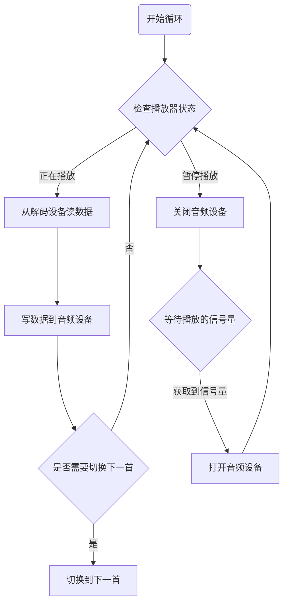
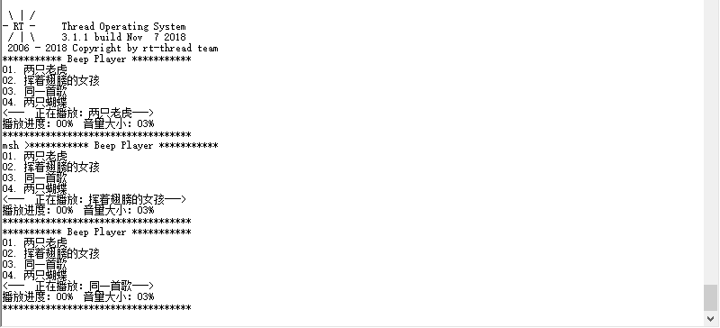

# 第 5 节：播放器的实现

这一节的任务是实现一个播放器的内核，主要就是实现：播放列表，暂停/播放、上一曲、下一曲，音量调节等功能。

## 播放器设计

为了实现这些功能，我们可以先创建一个结构体来存储播放器的信息及其当前的状态，例如：播放列表、当前的播放状态、音量大小等，如下所示：播放状态只有两种状态，正在播放和播放停止；`PLAYER_SONG_NUM_MAX` 默认定义为 10 首。

```{.c}
enum PLAYER_STATUS
{
    PLAYER_RUNNING, //正在播放
    PLAYER_STOP     //播放停止
};
struct player
{
    enum PLAYER_STATUS  status;          //当前播放状态
    uint8_t                  volume;          //声音大小
    uint8_t                  song_current;    //正在播放的歌曲
    uint8_t                  song_num;        //歌曲总数
    uint16_t                 song_time_pass;  //已经播放的时间
    uint16_t                 song_time_all;   //总播放时间
    void                     *song_sheet[PLAYER_SONG_NUM_MAX];     //歌曲列表
};
```

我们设计好了存储播放器当前状态信息的结构体之后，只要控制这个结构体就可以控制播放器的行为了。例如：改变播放器的状态 `status`，就可以控制播放的暂停和播放；改变正在播放的歌曲 `song_current`，就可以完成上一曲和下一曲的切换等。

要想播放音乐还有有解码器和音频设备啊，没有这两部分播放器自己是不能播放歌曲的。由于播放器是不知道如何解码，以及播放音乐的，因此只能留出一些操作接口，供解码器和音频设备实现。可以定义如下的操作接口，

```{.c}
struct audio_ops
{
    int (*init)(void);
    int (*open)(void);
    int (*close)(void);
    int (*control)(int cmd, void *arg);
    int (*write)(void *buffer, int size);
};
struct decode_ops
{
    int (*init)(void);
    int (*control)(void *song, int cmd, void *arg);
    int (*read)(void *song, int index, void *buffer, int size);
};
```

然后定义一些命令字，可以操作解码设备和音频设备。暂时先定义这些命令字，有需要时可以再添加。

```
enum AUDIO_OPS_CMD
{
    AUDIO_OPS_CMD_SET_VOL
};
enum DECODE_OPS_CMD
{
    DECODE_OPS_CMD_GET_NAME,
    DECODE_OPS_CMD_GET_LEN
};
```

然后播放器直接使用这些接口来控制解码和播放音频。

要想播放音乐，还需要有一个线程来播放音乐。这个播放线程的主要任务就是：从播放列表里获取音乐的数据，然后送到解码器解码，接着根据解码之后的数据来控制蜂鸣器的行为，播放音乐。

这个播放线程应该满足下面的条件，它要能时刻获取播放器的状态，当检测到播放器的播放状态变为停止状态时，能立即停止播放，然后阻塞住自己，等待播放信号的到来。当播放信号到来之后，可以重新进行播放。

怎么才能实现让播放线程挂起，然后在接收到一个信号之后再继续运行呢，这就可以利用信号量来实现。也就是当播放线程检测到播放器的状态改变之后就通过获取信号量挂起自身，然后等待开始播放的信号量，获取到信号量之后，播放线程才重新开始运行。

我们将播放器需要的线程、信号量、解码和音频操作接口都放到 player 的结构体里，player 结构体就变成了下面的结构：

```
struct player
{
    enum PLAYER_STATUS  status;          //当前播放状态
    uint8_t                  volume;          //声音大小
    uint8_t                  song_current;    //正在播放的歌曲
    uint8_t                  song_num;        //歌曲总数
    uint16_t                 song_time_pass;  //已经播放的时间
    uint16_t                 song_time_all;   //总播放时间
    void  *song_sheet[PLAYER_SONG_NUM_MAX];   //歌曲列表
    
    rt_sem_t                 sem_play;        //用于播放状态控制的信号量
    rt_thread_t              play_thread;     //播放的线程
    
    struct audio_ops        *audio;
    struct decode_ops       *decode;
};
typedef struct player *player_t;
```

这个播放线程大体的流程如下所示：




## 软件实现

### 播放线程

播放线程具体的代码如下,其中 PLAYER_BUFFER_SIZE 默认定义为 20。

```
static void player_entry(void *parameter)
{
    player_t player = (player_t)parameter;
    uint8_t buffer[PLAYER_BUFFER_SIZE], size;

    while (1)
    {
        if (player->status == PLAYER_RUNNING)
        {
            size = player->song_time_all - player->song_time_pass;
            if (size > PLAYER_BUFFER_SIZE) size = PLAYER_BUFFER_SIZE;
            size = player->decode->read(player->song_sheet[player->song_current - 1], player->song_time_pass, buffer, size);
            if (size > 0)
            {
                player->audio->write(buffer, size);
                player->song_time_pass += size;
            }
            /* 如果播放时间到了，切换到下一首 */
            if (player->song_time_pass >= player->song_time_all)
            {
                player_next(player);
                player_show(player);
            }
        }
        else
        {
            /* 暂停播放时关闭音频设备*/
            player->audio->close();

            /* 等待播放的信号量 */
            rt_sem_take(player->sem_play, RT_WAITING_FOREVER);

            /* 开始播放时打开音频设备*/
            player->audio->open();
        }
    }
}
```

当然一个播放器，肯定需要一些控制播放的 API 如下：

```
int player_play(player_t player);   //开始播放
int player_stop(player_t player);   //停止播放
int player_last(player_t player);   //上一曲
int player_next(player_t player);   //下一曲
```

### 开始播放

在开始播放的函数实现里，要将播放器的播放状态改为正在播放。然后释放一个信号量通知播放线程，开始播放。

注意：当我们要改变一个全局变量的值的时候，一定要注意互斥访问，就是不能让两个函数同时设定一个全局变量的值这样的事情发生。互斥访问的实现方法有很多，信号量，互斥锁，调度器锁，关中断等方法都可以保证资源的互斥访问，如果只是保护像**设定一个变量的值**这样一条语句或简单的几条语句这样的情况，可以直接使用关中断的方式。具体实现如下：

```
int player_play(player_t player)
{
    rt_uint32_t level;

    if (player->status != PLAYER_RUNNING)
    {
        /* 关闭全局中断 */
        level = rt_hw_interrupt_disable();

        /* 设定播放状态为播放状态 */
        player->status = PLAYER_RUNNING;

        /* 打开全局中断 */
        rt_hw_interrupt_enable(level);

        /*释放信号量通知播放线程开始播放*/
        rt_sem_release(player->sem_play);
    }

    return 0;
}

```

### 停止播放

在停止播放的函数实现里，只需要将播放器的播放状态改为停止播放即可。具体实现如下：

```
int player_stop(player_t player)
{
    rt_uint32_t level;

    if (player->status == PLAYER_RUNNING)
    {
        /* 关闭全局中断 */
        level = rt_hw_interrupt_disable();

        /* 设定播放状态为播放状态 */
        player->status = PLAYER_STOP;

        /* 打开全局中断 */
        rt_hw_interrupt_enable(level);
    }

    return 0;
}
```

### 上一曲

在切换上一曲的函数里，将当前播放歌曲的序号减一，然后更新一下结构体里的相关信息。如果当前播放器的状态不是正在播放的话，就调用一次开始播放函数。

```
int player_last(player_t player)
{
    uint16_t len;
    rt_uint32_t level;

    /* 关闭全局中断 */
    level = rt_hw_interrupt_disable();

    /* 将当前播放歌曲的序号 减一 */
    if (player->song_current > 1)
    {
        player->song_current --;
    }
    else
    {
        player->song_current = player->song_num;
    }

    /* 更新播放器的当前歌曲的播放时间以及总时间 */
    player->song_time_pass = 0;

    /* 打开全局中断 */
    rt_hw_interrupt_enable(level);

    player->decode->control(player->song_sheet[player->song_current - 1], DECODE_OPS_CMD_GET_LEN, &len);

    /* 关闭全局中断 */
    level = rt_hw_interrupt_disable();

    player->song_time_all = len;

    /* 打开全局中断 */
    rt_hw_interrupt_enable(level);

    if (player->status != PLAYER_RUNNING)
    {
        player_play(player);
    }

    return 0;
}
```

### 下一曲

在切换下一曲的函数里，和上一曲的操作相同，只不过是将当前播放歌曲的序号加一。

```
int player_next(player_t player)
{
    uint16_t len;
    rt_uint32_t level;

    /* 关闭全局中断 */
    level = rt_hw_interrupt_disable();

    /* 将当前播放歌曲的序号 加一 */
    if (player->song_current < player->song_num)
    {
        player->song_current ++;
    }
    else
    {
        player->song_current = 1;
    }

    /* 更新播放器的当前歌曲的播放时间以及总时间 */
    player->song_time_pass = 0;

    /* 打开全局中断 */
    rt_hw_interrupt_enable(level);

    player->decode->control(player->song_sheet[player->song_current - 1], DECODE_OPS_CMD_GET_LEN, &len);

    /* 关闭全局中断 */
    level = rt_hw_interrupt_disable();

    player->song_time_all = len;

    /* 打开全局中断 */
    rt_hw_interrupt_enable(level);

    if (player->status != PLAYER_RUNNING)
    {
        player_play(player);
    }

    return 0;
}
```

### 控制函数

为了更好的操作播放器，我们可以实现一个操作函数，用这个函数来控制播放器。

```
int player_control(player_t player, int cmd, void *arg);
```

设定的一些控制播放器的控制字，这样就可以减少API 的个数方便其他模块的使用。

```
enum PLAYER_CMD
{
    PLAYER_CMD_PLAY,
    PLAYER_CMD_STOP,
    PLAYER_CMD_LAST,
    PLAYER_CMD_NEXT,
    PLAYER_CMD_SET_VOL,
    PLAYER_CMD_GET_VOL,
    PLAYER_CMD_GET_STATUS
};
```

具体的实现如下所示：

```
int player_control(player_t player, int cmd, void *arg)
{
    rt_uint32_t level;

    switch (cmd)
    {
    case PLAYER_CMD_PLAY:
        player_play(player);
        break;
    case PLAYER_CMD_STOP:
        player_stop(player);
        break;
    case PLAYER_CMD_LAST:
        player_last(player);
        break;
    case PLAYER_CMD_NEXT:
        player_next(player);
        break;
    case PLAYER_CMD_SET_VOL:
        /* 关闭全局中断 */
        level = rt_hw_interrupt_disable();
        player->volume = *(uint8_t *)arg;
        /* 打开全局中断 */
        rt_hw_interrupt_enable(level);
        player->audio->control(AUDIO_OPS_CMD_SET_VOL, &player->volume);
        break;
    case PLAYER_CMD_GET_VOL:
        *(uint8_t *)arg = player->volume;
        break;
    case PLAYER_CMD_GET_STATUS:
        *(uint8_t *)arg = player->status;
        break;
    }
    return 0;
}
```

### 显示信息

然后我们可以实现一个打印播放器的歌单，当前的播放状态，正在播放的歌曲，以及进度和音量大小等信息，我们只要简单的写几个 `rt_kprintf` 函数将这些信息打印出来就好了。然后我们可以把这个函数放到歌曲的切换的位置，这样每改变一次播放器的状态就会打印一次播放器当前的状态。实际的代码如下所示,其中 `PLAYER_SONG_NAME_LEN_MAX` 默认定义为 20

```
int player_show(player_t player)
{
    char name[PLAYER_SONG_NAME_LEN_MAX + 1];
    uint8_t i;
    uint16_t percent;

    rt_kprintf("*********** Beep Player ***********\n");

    /* 打印歌单 */
    for (i = 0; i < player->song_num; i++)
    {
        player->decode->control(player->song_sheet[i], DECODE_OPS_CMD_GET_NAME, name);
        rt_kprintf("%02d. %s\n", i + 1, name);
    }

    /* 打印当前播放状态 */
    if (PLAYER_RUNNING == player->status)
    {
        rt_kprintf("<---  正在播放：");
    }
    else
    {
        rt_kprintf("<---  暂停播放：");
    }

    /* 打印当前歌曲 */
    player->decode->control(player->song_sheet[player->song_current - 1], DECODE_OPS_CMD_GET_NAME, name);
    rt_kprintf("%s", name);
    rt_kprintf("--->\n");

    /* 打印播放进度 */
    percent = player->song_time_pass * 100 / player->song_time_all;
    rt_kprintf("播放进度：%02d%%  音量大小：%02d%%\n", percent, player->volume);

    rt_kprintf("***********************************\n");

    return 0;
}
```

### 添加歌曲

添加歌曲到播放列表，要实现这个功能，只要将歌曲信息的首地址添加到播放列表的数组里，然后将歌曲的个数加一即可。实现如下：

```
int player_add_song(player_t player, void *song)
{
    rt_uint32_t level;

    if (player->song_num == PLAYER_SONG_NUM_MAX)
    {
        return -1;
    }
    /* 关闭全局中断 */
    level = rt_hw_interrupt_disable();

    player->song_sheet[player->song_num] = song;
    player->song_num++;

    /* 打开全局中断 */
    rt_hw_interrupt_enable(level);

    return 0;
}
```

### 启动播放器

在启动播放器的函数里，需要完成 player 这个结构体对象的初始化，为结构体内部的各个变量赋初值。然后调用解码和音频的操作函数，初始化解码器和音频设备。然后初始化信号量并创建播放线程。不过为了保证播放器能正常的工作，应该先添加歌曲，再启动播放器。其中 PLAYER_SOUND_SIZE_DEFAULT 默认定义为 3。

```
int player_start(player_t player)
{
    uint16_t len;
    static rt_uint8_t inited = 0;

    /* 检测播放器是否已经在运行 */
    if (inited == 1)
    {
        return -RT_ERROR;
    }

    if (player->song_num == 0)
    {
        return -1;
    }
    /* 调用接口初始化解码器 */
    player->decode->init();

    player->status = PLAYER_STOP;
    player->volume = PLAYER_SOUND_SIZE_DEFAULT;
    player->song_current = 1;
    player->song_time_pass = 0;
    player->decode->control(player->song_sheet[player->song_current - 1], DECODE_OPS_CMD_GET_LEN, &len);
    player->song_time_all = len;

    /* 调用接口初始化音频设备 */
    player->audio->init();
    player->audio->control(AUDIO_OPS_CMD_SET_VOL, &player->volume);

    /* 初始化动态信号量 */
    player->sem_play = rt_sem_create("sem_play", 0, RT_IPC_FLAG_FIFO);
    if (player->sem_play == RT_NULL)
    {
        return -RT_ERROR;
    }

    /* 创建动态线程 */
    player->play_thread = rt_thread_create("player",
                                           player_entry, player,
                                           512, 20, 20);
    if (player->play_thread != RT_NULL)
    {
        rt_thread_startup(player->play_thread);
    }
    else
    {
        rt_sem_delete(player->sem_play);
        return -RT_ERROR;
    }
    inited = 1;

    return 0;
}
```

## 示例程序

这个播放器的内核应该如何使用呢？首先需要包含头文件 `#include "player.h"`  ，然后需要定义播放器的结构体 `struct player player` ，还要对接上播放器的解码和音频播放的接口。对接上接口之后，就添加歌曲，然后启动播放器，控制播放器改为播放状态，并打印一次播放器状态。为了更好的展示播放器的列表循环播放，需要多准备几首歌，我们新建一个 `song_data.h` 然后将下面的内容复制进去，在这里面存储了4首歌的数据，可以包含在示例程序里使用。

```
#ifndef SONG_DATA_H
#define SONG_DATA_H

#include "decode.h"

const struct beep_song song1 =
{
    .name = "两只老虎",
    .data = {
        0x15, 0x02, 0x16, 0x02, 0x17, 0x02, 0x15, 0x02, 0x15, 0x02,
        // 1         2            3           1           1
        0x16, 0x02, 0x17, 0x02, 0x15, 0x02, 0x17, 0x02, 0x18, 0x02,
        // 2         3            1           3           4
        0x19, 0x01, 0x17, 0x02, 0x18, 0x02, 0x19, 0x01, 0x19, 0x03,
        // 5   -     3            4           5    -      5_
        0x1A, 0x03, 0x19, 0x03, 0x18, 0x03, 0x17, 0x02, 0x15, 0x16,
        // 6_        5_           4_          3           1
        0x19, 0x03, 0x1A, 0x03, 0x19, 0x03, 0x18, 0x03, 0x17, 0x02,
        // 5_        6_           5_          4_          3
        0x15, 0x16, 0x15, 0x02, 0x0F, 0x02, 0x15, 0x01, 0x15, 0x02,
        // 1         1            5.          1    -      1
        0x0F, 0x02, 0x15, 0x01, 0x00, 0x00
        // 5.        1     -
    }
};

const struct beep_song song2 =
{
    .name = "挥着翅膀的女孩",
    .data = {
        0x17, 0x02, 0x17, 0x03, 0x18, 0x03, 0x19, 0x02, 0x15, 0x03,
        0x16, 0x03, 0x17, 0x03, 0x17, 0x03, 0x17, 0x03, 0x18, 0x03,
        0x19, 0x02, 0x16, 0x03, 0x17, 0x03, 0x18, 0x02, 0x18, 0x03,
        0x17, 0x03, 0x15, 0x02, 0x18, 0x03, 0x17, 0x03, 0x18, 0x02,
        0x10, 0x03, 0x15, 0x03, 0x16, 0x02, 0x15, 0x03, 0x16, 0x03,
        0x17, 0x02, 0x17, 0x03, 0x18, 0x03, 0x19, 0x02, 0x1A, 0x03,
        0x1B, 0x03, 0x1F, 0x03, 0x1F, 0x03, 0x17, 0x03, 0x18, 0x03,
        0x19, 0x02, 0x16, 0x03, 0x17, 0x03, 0x18, 0x03, 0x17, 0x03,
        0x18, 0x03, 0x1F, 0x03, 0x1F, 0x02, 0x16, 0x03, 0x17, 0x03,
        0x18, 0x03, 0x17, 0x03, 0x18, 0x03, 0x20, 0x03, 0x20, 0x02,
        0x1F, 0x03, 0x1B, 0x03, 0x1F, 0x66, 0x20, 0x03, 0x21, 0x03,
        0x20, 0x03, 0x1F, 0x03, 0x1B, 0x03, 0x1F, 0x66, 0x1F, 0x03,
        0x1B, 0x03, 0x19, 0x03, 0x19, 0x03, 0x15, 0x03, 0x1A, 0x66,
        0x1A, 0x03, 0x19, 0x03, 0x15, 0x03, 0x15, 0x03, 0x17, 0x03,
        0x16, 0x66, 0x17, 0x04, 0x18, 0x04, 0x18, 0x03, 0x19, 0x03,
        0x1F, 0x03, 0x1B, 0x03, 0x1F, 0x66, 0x20, 0x03, 0x21, 0x03,
        0x20, 0x03, 0x1F, 0x03, 0x1B, 0x03, 0x1F, 0x66, 0x1F, 0x03,
        0x1B, 0x03, 0x19, 0x03, 0x19, 0x03, 0x15, 0x03, 0x1A, 0x66,
        0x1A, 0x03, 0x19, 0x03, 0x19, 0x03, 0x1F, 0x03, 0x1B, 0x03,
        0x1F, 0x00, 0x1A, 0x03, 0x1A, 0x03, 0x1A, 0x03, 0x1B, 0x03,
        0x1B, 0x03, 0x1A, 0x03, 0x19, 0x03, 0x19, 0x02, 0x17, 0x03,
        0x15, 0x17, 0x15, 0x03, 0x16, 0x03, 0x17, 0x03, 0x18, 0x03,
        0x17, 0x04, 0x18, 0x0E, 0x18, 0x03, 0x17, 0x04, 0x18, 0x0E,
        0x18, 0x66, 0x17, 0x03, 0x18, 0x03, 0x17, 0x03, 0x18, 0x03,
        0x20, 0x03, 0x20, 0x02, 0x1F, 0x03, 0x1B, 0x03, 0x1F, 0x66,
        0x20, 0x03, 0x21, 0x03, 0x20, 0x03, 0x1F, 0x03, 0x1B, 0x03,
        0x1F, 0x66, 0x1F, 0x04, 0x1B, 0x0E, 0x1B, 0x03, 0x19, 0x03,
        0x19, 0x03, 0x15, 0x03, 0x1A, 0x66, 0x1A, 0x03, 0x19, 0x03,
        0x15, 0x03, 0x15, 0x03, 0x17, 0x03, 0x16, 0x66, 0x17, 0x04,
        0x18, 0x04, 0x18, 0x03, 0x19, 0x03, 0x1F, 0x03, 0x1B, 0x03,
        0x1F, 0x66, 0x20, 0x03, 0x21, 0x03, 0x20, 0x03, 0x1F, 0x03,
        0x1B, 0x03, 0x1F, 0x66, 0x1F, 0x03, 0x1B, 0x03, 0x19, 0x03,
        0x19, 0x03, 0x15, 0x03, 0x1A, 0x66, 0x1A, 0x03, 0x19, 0x03,
        0x19, 0x03, 0x1F, 0x03, 0x1B, 0x03, 0x1F, 0x00, 0x18, 0x02,
        0x18, 0x03, 0x1A, 0x03, 0x19, 0x0D, 0x15, 0x03, 0x15, 0x02,
        0x18, 0x66, 0x16, 0x02, 0x17, 0x02, 0x15, 0x00, 0x00, 0x00
    }
};

const struct beep_song song3 =
{
    .name = "同一首歌",
    .data = {
        0x0F, 0x01, 0x15, 0x02, 0x16, 0x02, 0x17, 0x66, 0x18, 0x03,
        0x17, 0x02, 0x15, 0x02, 0x16, 0x01, 0x15, 0x02, 0x10, 0x02,
        0x15, 0x00, 0x0F, 0x01, 0x15, 0x02, 0x16, 0x02, 0x17, 0x02,
        0x17, 0x03, 0x18, 0x03, 0x19, 0x02, 0x15, 0x02, 0x18, 0x66,
        0x17, 0x03, 0x19, 0x02, 0x16, 0x03, 0x17, 0x03, 0x16, 0x00,
        0x17, 0x01, 0x19, 0x02, 0x1B, 0x02, 0x1B, 0x70, 0x1A, 0x03,
        0x1A, 0x01, 0x19, 0x02, 0x19, 0x03, 0x1A, 0x03, 0x1B, 0x02,
        0x1A, 0x0D, 0x19, 0x03, 0x17, 0x00, 0x18, 0x66, 0x18, 0x03,
        0x19, 0x02, 0x1A, 0x02, 0x19, 0x0C, 0x18, 0x0D, 0x17, 0x03,
        0x16, 0x01, 0x11, 0x02, 0x11, 0x03, 0x10, 0x03, 0x0F, 0x0C,
        0x10, 0x02, 0x15, 0x00, 0x1F, 0x01, 0x1A, 0x01, 0x18, 0x66,
        0x19, 0x03, 0x1A, 0x01, 0x1B, 0x02, 0x1B, 0x03, 0x1B, 0x03,
        0x1B, 0x0C, 0x1A, 0x0D, 0x19, 0x03, 0x17, 0x00, 0x1F, 0x01,
        0x1A, 0x01, 0x18, 0x66, 0x19, 0x03, 0x1A, 0x01, 0x10, 0x02,
        0x10, 0x03, 0x10, 0x03, 0x1A, 0x0C, 0x18, 0x0D, 0x17, 0x03,
        0x16, 0x00, 0x0F, 0x01, 0x15, 0x02, 0x16, 0x02, 0x17, 0x70,
        0x18, 0x03, 0x17, 0x02, 0x15, 0x03, 0x15, 0x03, 0x16, 0x66,
        0x16, 0x03, 0x16, 0x02, 0x16, 0x03, 0x15, 0x03, 0x10, 0x02,
        0x10, 0x01, 0x11, 0x01, 0x11, 0x66, 0x10, 0x03, 0x0F, 0x0C,
        0x1A, 0x02, 0x19, 0x02, 0x16, 0x03, 0x16, 0x03, 0x18, 0x66,
        0x18, 0x03, 0x18, 0x02, 0x17, 0x03, 0x16, 0x03, 0x19, 0x00,
        0x00, 0x00
    }
};

const struct beep_song song4 =
{
    .name = "两只蝴蝶",
    .data = {
        0x17, 0x03, 0x16, 0x03, 0x17, 0x01, 0x16, 0x03, 0x17, 0x03,
        0x16, 0x03, 0x15, 0x01, 0x10, 0x03, 0x15, 0x03, 0x16, 0x02,
        0x16, 0x0D, 0x17, 0x03, 0x16, 0x03, 0x15, 0x03, 0x10, 0x03,
        0x10, 0x0E, 0x15, 0x04, 0x0F, 0x01, 0x17, 0x03, 0x16, 0x03,
        0x17, 0x01, 0x16, 0x03, 0x17, 0x03, 0x16, 0x03, 0x15, 0x01,
        0x10, 0x03, 0x15, 0x03, 0x16, 0x02, 0x16, 0x0D, 0x17, 0x03,
        0x16, 0x03, 0x15, 0x03, 0x10, 0x03, 0x15, 0x03, 0x16, 0x01,
        0x17, 0x03, 0x16, 0x03, 0x17, 0x01, 0x16, 0x03, 0x17, 0x03,
        0x16, 0x03, 0x15, 0x01, 0x10, 0x03, 0x15, 0x03, 0x16, 0x02,
        0x16, 0x0D, 0x17, 0x03, 0x16, 0x03, 0x15, 0x03, 0x10, 0x03,
        0x10, 0x0E, 0x15, 0x04, 0x0F, 0x01, 0x17, 0x03, 0x19, 0x03,
        0x19, 0x01, 0x19, 0x03, 0x1A, 0x03, 0x19, 0x03, 0x17, 0x01,
        0x16, 0x03, 0x16, 0x03, 0x16, 0x02, 0x16, 0x0D, 0x17, 0x03,
        0x16, 0x03, 0x15, 0x03, 0x10, 0x03, 0x10, 0x0D, 0x15, 0x00,
        0x19, 0x03, 0x19, 0x03, 0x1A, 0x03, 0x1F, 0x03, 0x1B, 0x03,
        0x1B, 0x03, 0x1A, 0x03, 0x17, 0x0D, 0x16, 0x03, 0x16, 0x03,
        0x16, 0x0D, 0x17, 0x01, 0x17, 0x03, 0x17, 0x03, 0x19, 0x03,
        0x1A, 0x02, 0x1A, 0x02, 0x10, 0x03, 0x17, 0x0D, 0x16, 0x03,
        0x16, 0x01, 0x17, 0x03, 0x19, 0x03, 0x19, 0x03, 0x17, 0x03,
        0x19, 0x02, 0x1F, 0x02, 0x1B, 0x03, 0x1A, 0x03, 0x1A, 0x0E,
        0x1B, 0x04, 0x17, 0x02, 0x1A, 0x03, 0x1A, 0x03, 0x1A, 0x0E,
        0x1B, 0x04, 0x1A, 0x03, 0x19, 0x03, 0x17, 0x03, 0x16, 0x03,
        0x17, 0x0D, 0x16, 0x03, 0x17, 0x03, 0x19, 0x01, 0x19, 0x03,
        0x19, 0x03, 0x1A, 0x03, 0x1F, 0x03, 0x1B, 0x03, 0x1B, 0x03,
        0x1A, 0x03, 0x17, 0x0D, 0x16, 0x03, 0x16, 0x03, 0x16, 0x03,
        0x17, 0x01, 0x17, 0x03, 0x17, 0x03, 0x19, 0x03, 0x1A, 0x02,
        0x1A, 0x02, 0x10, 0x03, 0x17, 0x0D, 0x16, 0x03, 0x16, 0x01,
        0x17, 0x03, 0x19, 0x03, 0x19, 0x03, 0x17, 0x03, 0x19, 0x03,
        0x1F, 0x02, 0x1B, 0x03, 0x1A, 0x03, 0x1A, 0x0E, 0x1B, 0x04,
        0x17, 0x02, 0x1A, 0x03, 0x1A, 0x03, 0x1A, 0x0E, 0x1B, 0x04,
        0x17, 0x16, 0x1A, 0x03, 0x1A, 0x03, 0x1A, 0x0E, 0x1B, 0x04,
        0x1A, 0x03, 0x19, 0x03, 0x17, 0x03, 0x16, 0x03, 0x0F, 0x02,
        0x10, 0x03, 0x15, 0x00, 0x00, 0x00
    }
};

#endif
```

在对接接口时，需要注意，音频设备写的音频数据就是从解码器那里读来的，所以只要自己的知道音频数据怎么播放，并在音频设备写的接口里完成播放即可。还有就是解码函数读接口返回的长度表示：当次读数据歌曲进度增加的量，因为只返回了一个音符的数据，因此歌曲的进度相应的也只加1。示例代码如下：

```
#include <rtthread.h>

#include "player.h"
#include "song_data.h"
#include "beep.h"
#include "decode.h"

struct player player;
struct audio_ops audio;
struct decode_ops decode;

uint8_t beep_volume = 3;

int decode_read(void *song, int index, void *buffer, int size)
{
    beep_song_get_data(song, index, buffer);

    return 1;
}

int audio_write(void *buffer, int size)
{
    struct beep_song_data *data = buffer;

    beep_on();
    beep_set(data->freq, beep_volume);
    rt_thread_mdelay(data->sound_len);
    beep_off();
    rt_thread_mdelay(data->nosound_len);

    return size;
}
int decode_control(void *song, int cmd, void *arg)
{
    if (cmd == DECODE_OPS_CMD_GET_NAME)
        beep_song_get_name(song, arg);
    else if (cmd == DECODE_OPS_CMD_GET_LEN)
        *(uint16_t *)arg = beep_song_get_len(song);
    return 0;
}
int audio_control(int cmd, void *arg)
{
    if (cmd == AUDIO_OPS_CMD_SET_VOL)
        beep_volume = *(uint8_t *)arg;
    return beep_volume;
}

int player_init(void)
{
    decode.init = beep_song_decode_init;
    decode.control = decode_control;
    decode.read = decode_read;

    audio.init = beep_init;
    audio.open = beep_on;
    audio.close = beep_off;
    audio.control = audio_control;
    audio.write = audio_write;

    player.decode = &decode;
    player.audio = &audio;

    player_add_song(&player, (void *)&song1);
    player_add_song(&player, (void *)&song2);
    player_add_song(&player, (void *)&song3);
    player_add_song(&player, (void *)&song4);
    player_start(&player);

    player_control(&player, PLAYER_CMD_PLAY, RT_NULL);
    player_show(&player);

    return 0;
}

int main(void)
{
    /* user app entry */
    player_init();
    return 0;
}
```



## 程序源码

[player.c/.h](https://github.com/Guozhanxin/RTT-BeepPlayer/tree/master/code/player)

[song_data.h](https://github.com/Guozhanxin/RTT-BeepPlayer/blob/master/samples/song_data.h)

[示例程序](https://github.com/Guozhanxin/RTT-BeepPlayer/blob/master/samples/main_4.c)

