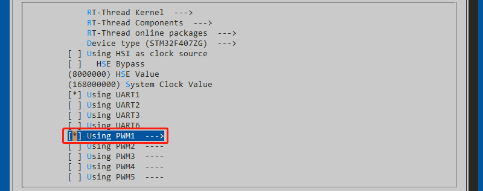
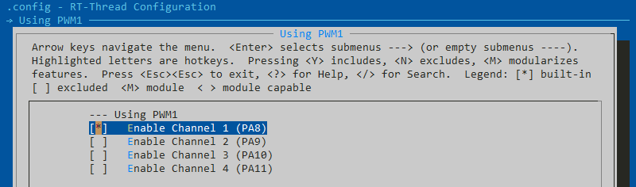
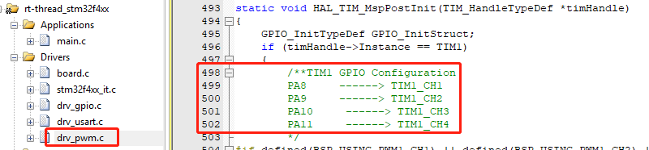
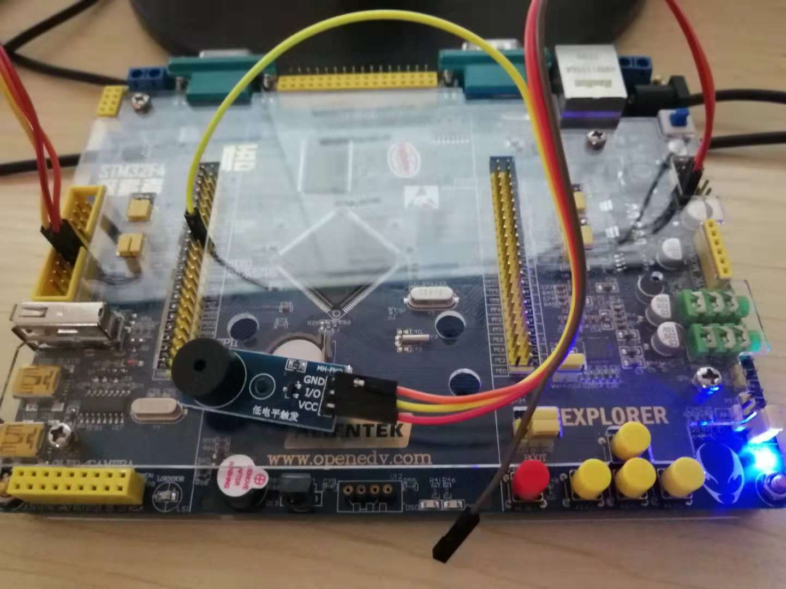

# 第 3 节：使用 PWM 设备驱动蜂鸣器

## 基础知识

只有无源蜂鸣器才能够用来播放音乐。因为无源蜂鸣器振动的频率是可调的，而有源蜂鸣器的振动频率是固定的。只有频率（也就是音高）可调，才能够播放简单的音乐。由于无源蜂鸣器需要有震荡信号才能发出声音，所以需要使用 PWM 设备来控制蜂鸣器的播放。

为了给用户提供产生 PWM 的通用 API，方便应用程序开发，RT-Thread 中引入了 PWM 设备驱动。并提供 API 用于操作 PWM 设备，如设置 PWM 的周期及高电平的脉宽、开启 PWM 通道的输出、关闭 PWM 通道的输出。

常用的 PWM 设备的 API 有以下几个：

| API            | 描述                    |
| -------------- | ----------------------- |
| rt_pwm_set     | 设置 PWM 某一通道的参数 |
| rt_pwm_enable  | 开启 PWM 通道的输出     |
| rt_pwm_disable | 关闭 PWM 通道的输出     |

### 开启 PWM 功能

要使用 PWM 设备需要在 env 中开启 PWM 设备，如下所示。然后回车，在具体的配置里开启通道一，保存并重新生成工程。





## 硬件连接

由于 PWM 设备是基于定时器 Timer 实现的，所以只有与定时器相应通道连接的管脚才能输出 PWM。查看已经实现的 PWM 设备的驱动文件 `drv_pwm.c`，从中可以看到当前 PWM 设备支持的管脚，我们选择与 TIM1 通道1对应的管脚 PA8 作为驱动蜂鸣器的管脚。



使用杜邦线将无源蜂鸣器和开发板连接起来，其中 VCC 接 3.3V，GND 接 GND， I/O 引脚连接开发板的 PA8。



## 软件实现

利用 RT-Thread 的 PWM 设备可以很轻松的控制 IO 口输出的脉冲的频率和占空比，这就为控制蜂鸣器提供了方便。我们可以将 PWM 设备的 API 封装成函数，来作为蜂鸣器的控制接口，例如我们可以封装成下面的四个函数，一个初始化函数，一个开、一个关，再加一个设定频率和响度的函数，就能很好的控制蜂鸣器了。

```{.c}
static int beep_init(void);              //蜂鸣器初始化
static int beep_on(void);                //蜂鸣器开
static int beep_off(void);               //蜂鸣器关
static int beep_set(uint16_t freq, uint8_t volume); //蜂鸣器设定
```

同样我们新建一个 `beep.h` 的文件，将上面的这些函数声明放到  `beep.h` 文件里，方便其他文件的调用。直接在头文件里使用 `uint16_t/uint8_t` 的数据类型会报错，因此在头文件里包含 `rtthread.h` 头文件。

为了程序更好的可移植性，把 beep 使用的 PWM 设备用宏定义的方式来表示，如下所示：

```{.c}
#define BEEP_PWM_DEVICE  "pwm1"
#define BEEP_PWM_CH      1
```

最后 `beep.h` 文件中内容如下所示：

```{.c}
#ifndef BEEP_H
#define BEEP_H

#include <rtthread.h>

#define BEEP_PWM_DEVICE  "pwm1"
#define BEEP_PWM_CH      1

int beep_init(void);                         //蜂鸣器初始化
int beep_on(void);                           //蜂鸣器开
int beep_off(void);                          //蜂鸣器关
int beep_set(uint16_t freq, uint8_t volume); //蜂鸣器设定

#endif
```

然后再新建一个 `beep.c` 文件，在文件里添加下面的头文件

```{.c}
#include <rtdevice.h>  //使用 RT-Thread 的设备需要包含此头文件
```


然后在文件 `beep.c` 里分别实现上面的几个 API。

### 蜂鸣器初始化

```{.c}
static int beep_init(void);              //蜂鸣器初始化
```

要想使用某一个 PWM 设备（例如 PWM1），需要先依据名字获取到设备的控制块，然后在调用 PWM 的 API 时作为参数传入。

为了能够使用 API 控制 PWM 设备，在蜂鸣器初始化函数里，需要获取 PWM 设备的设备控制块。

```{.c}
struct rt_device_pwm     *pwm_device = RT_NULL; //定义 pwm 设备指针

int beep_init(void)
{
    /* 查找PWM设备 */
    pwm_device = (struct rt_device_pwm *)rt_device_find(BEEP_PWM_DEVICE);
    if (pwm_device == RT_NULL)
    {
        rt_kprintf("pwm device %s not found!\n", BEEP_PWM_DEVICE);
        return -RT_ERROR;
    }
    return 0;
}
```

### 打开蜂鸣器

```{.c}
int beep_on(void);                //蜂鸣器开
```

在打开蜂鸣器的函数里，通过调用 `rt_pwm_enable` API 开启 PWM 通道的输出功能。

```{.c}
static int beep_on(void)
{
    rt_pwm_enable(pwm_device, BEEP_PWM_CH); //使能蜂鸣器对应的 PWM 通道
    return 0;
}
```

### 关闭蜂鸣器

```{.c}
int beep_off(void);               //蜂鸣器关
```

在关闭蜂鸣器的函数里，通过调用 `rt_pwm_disable` API 关闭 PWM 通道的输出功能。

```{.c}
int beep_off(void)
{
    rt_pwm_disable(pwm_device, BEEP_PWM_CH); //失能蜂鸣器对应的 PWM 通道
    return 0;
}
```

### 蜂鸣器设定

```{.c}
static int beep_set(uint16_t freq, uint8_t volume); //蜂鸣器设定
```

在蜂鸣器设定函数里需要设定 蜂鸣器的频率和音量。PWM 设备设定的 API 是设定 **周期** 和 **脉宽** 的，因此我们需要转换一下，将频率装换成周期，将音量大小（占空比）转换成脉宽。这里的周期的单位是 **ns**，因此转换成的 **秒** 之后还要乘以 10^9 。由于无源蜂鸣器一般是低电平触发的，因此音量越大对应的脉宽就要越小。然后，将转换后的数据传入 `rt_pwm_set` 来设置 PWM 设备的参数。

```{.c}
static int beep_set(uint16_t freq, uint8_t volume)
{
    rt_uint32_t period, pulse;

    /* 将频率转化为周期 周期单位:ns 频率单位:HZ */
    period = 1000000000 / freq;  //unit:ns 1/HZ*10^9 = ns

    /* 根据声音大小计算占空比 蜂鸣器低电平触发 */
    pulse = period - period / 100 * volume;

    /* 利用 PWM API 设定 周期和占空比 */
    rt_pwm_set(pwm_device, BEEP_PWM_CH, period, pulse);//channel,period,pulse

    return 0;
}
```

## 示例程序

 这样就可以在 `main.c` 里包含 `beep.h` 头文件，然后使用这些 API 来控制蜂鸣器了。

下面是一段控制无源蜂鸣器依次播放音符 CDEFGAB 的一段程序。

```
#include <rtthread.h>
#include "beep.h"

uint16_t freq_tab[12]  = {262, 277, 294, 311, 330, 349, 369, 392, 415, 440, 466, 494}; //原始频率表 CDEFGAB
uint8_t beep_volume = 3;

int main(void)
{
    /* user app entry */
    int i;

    beep_init();

    for (i = 0; i < 12; i++)
    {
        beep_set(freq_tab[i], beep_volume);
        beep_on();

        rt_thread_mdelay(500);

        beep_off();
        rt_thread_mdelay(500);
    }

    return 0;
}
```

## 程序源码

[beep.c/.h](https://github.com/Guozhanxin/RTT-BeepPlayer/tree/master/code/beep)

[示例程序](https://github.com/Guozhanxin/RTT-BeepPlayer/blob/master/samples/main_2.c)